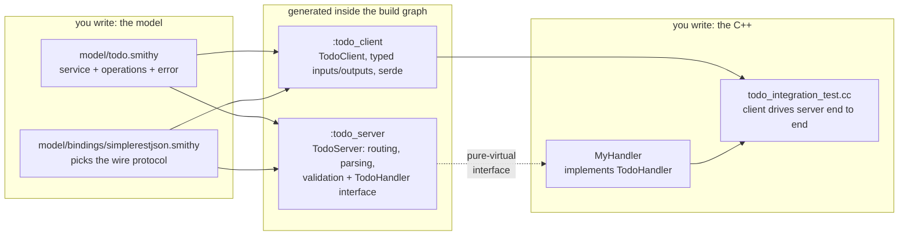

# Quick start: model → client + server in one Bazel module

From an empty directory to a generated C++ client integration-testing a generated C++ server —
no prior [Smithy](https://smithy.io) experience assumed, and no generator internals to learn.

If Smithy is new to you: it's an interface-definition language. You describe a service once —
its operations, their inputs and outputs, the errors they can raise — in a small `.smithy`
text file, and code generators produce the client, the server scaffolding, and the wire
handling in whatever language you need. smithy-cpp is that generator for C++. You write the
model and the business logic; parsing, routing, validation, serialization, and error mapping
are generated.

The finished result of every step below lives at
[`examples/bazel-consumer/`](../examples/bazel-consumer) — CI builds that module standalone on
every commit, so this tutorial cannot silently rot. How the pieces fit:



The integration test then drives the loop end to end: `TodoClient` → HTTP (in-memory loopback
or a real socket) → `TodoServer` → your `MyHandler` → back out as a typed response.

## 1. Create a Bazel module

`MODULE.bazel`:

```starlark
module(name = "my_service", version = "0.0.0")

bazel_dep(name = "smithy_cpp", version = "0.0.0")

# Until smithy_cpp is published to the Bazel Central Registry (deferred until
# the project is production-validated), consume it by git override. No release
# is tagged yet, so pin a specific commit on main (copy the full SHA from
# https://github.com/aaylward/smithy-cpp/commits/main). The `version` above is
# ignored while an override is in effect.
git_override(
    module_name = "smithy_cpp",
    remote = "https://github.com/aaylward/smithy-cpp.git",
    commit = "0000000000000000000000000000000000000000",  # replace with a real commit SHA
)

bazel_dep(name = "googletest", version = "1.17.0.bcr.2")
bazel_dep(name = "rules_cc", version = "0.2.17")
```

`.bazelrc` (C++20 is the runtime baseline; the generator runs on a hermetic Java 17 toolchain,
so you never install or invoke Java yourself). Supported platforms are Linux and macOS
([ADR-0008](adr/0008-drop-windows-support.md) dropped Windows):

```
# C++20 (the smithy-cpp runtime baseline) and the Java 17 toolchain the
# generator action runs on. Copy these lines into your own .bazelrc.
common --enable_platform_specific_config

build:linux --cxxopt=-std=c++20 --host_cxxopt=-std=c++20
build:macos --cxxopt=-std=c++20 --host_cxxopt=-std=c++20
common --java_language_version=17
common --tool_java_language_version=17
common --java_runtime_version=remotejdk_17
common --tool_java_runtime_version=remotejdk_17
test --test_output=errors

# Personal overrides stay out of version control.
try-import %workspace%/.bazelrc.user
```

(This is byte-for-byte the CI-tested [`examples/bazel-consumer/.bazelrc`](../examples/bazel-consumer/.bazelrc);
`QuickstartMirrorTest` fails the build if this page and the example ever diverge.)

Pin your Bazel track with a `.bazelversion` so bazelisk resolves the same major version
everywhere — the CI-tested example (like this repo) pins `9.x`.

## 2. Write the model

(When a model is invalid, the generation action fails and the `cpp-codegen:` line at the top of
its stderr names the problem — a Smithy validation failure lists every event. You never need to
read the Java stack trace below it; if there is no `cpp-codegen:` line at all, you have found a
generator bug worth reporting. [Troubleshooting generation failures](#troubleshooting-generation-failures)
covers the full failure-reading guide.)

`model/todo.smithy` — a deliberately small task tracker: add a task, fetch it back, and one
thing that can go wrong. This is the entire file:

```smithy
$version: "2.0"

namespace acme.todo

/// A tiny task tracker: create a task, fetch it back.
service Todo {
    version: "2026-01-01"
    operations: [AddTask, GetTask]
}

@http(method: "POST", uri: "/tasks")
operation AddTask {
    input := {
        @required
        @length(min: 1, max: 256)
        title: String
    }

    output := {
        @required
        taskId: String

        @required
        title: String
    }
}

@readonly
@http(method: "GET", uri: "/tasks/{taskId}")
operation GetTask {
    input := {
        @required
        @httpLabel
        taskId: String
    }

    output := {
        @required
        taskId: String

        @required
        title: String

        done: Boolean
    }

    errors: [NoSuchTask]
}

@error("client")
@httpError(404)
structure NoSuchTask {
    @required
    message: String
}
```

Reading it as a Smithy newcomer:

- **`namespace acme.todo`** scopes every name in the file; `acme.todo#Todo` is the service's
  full identity (you'll pass it to the build rule in step 3).
- **`service Todo`** is the entry point: it lists the operations clients can call. It becomes
  `TodoClient`, the pure-virtual `TodoHandler` interface, and `TodoServer` in C++.
- **`operation AddTask`** declares one callable action. The `input :=` / `output :=` blocks
  are inline structure definitions — each becomes a plain C++ struct (`AddTaskInput`,
  `AddTaskOutput`), and the operation becomes a method on both the client and the handler.
- **The `@...` annotations are traits** — metadata attached to shapes and members. They do all
  the heavy lifting:
  - `@required` makes a member mandatory; non-required members map to `std::optional<T>` in
    C++ and to "absent on the wire" in JSON.
  - `@length(min: 1, max: 256)` is a constraint: the generated *server* rejects violations
    with a 400 `ValidationException` before your handler ever runs. (`@pattern`, `@range`,
    and friends work the same way.)
  - `@http` / `@httpLabel` describe HTTP semantics: `AddTask` is `POST /tasks` with the input
    as the JSON body; `GetTask` binds `taskId` into the path as `GET /tasks/{taskId}`.
  - `@error("client")` + `@httpError(404)` make `NoSuchTask` a modeled error: the server maps
    it to a 404, and the client surfaces it as a *typed* value, not a string.
- **`errors: [NoSuchTask]`** declares which errors an operation can raise, so both sides know
  the full contract.

On the wire, that model means:

| Call | Request | Success | Error |
|---|---|---|---|
| `AddTask` | `POST /tasks` `{"title": "buy milk"}` | `{"taskId": "task-1", "title": "buy milk"}` | 400 `ValidationException` (e.g. empty title) |
| `GetTask` | `GET /tasks/task-1` | `{"taskId": "task-1", "title": "buy milk", "done": false}` | 404 `NoSuchTask` |

Notice the model never names a wire protocol — `@http` describes *HTTP semantics*, not an
encoding. That's deliberate (and the upstream-Smithy way): the concrete protocol is bound in a
tiny overlay file, using `apply` to attach a trait to the service from outside the base model:

```smithy
// model/bindings/simplerestjson.smithy
$version: "2.0"
namespace acme.todo
use alloy#simpleRestJson
apply Todo @simpleRestJson
```

(Applying the trait directly on the service works too, if you only ever want one protocol.
Keeping it in an overlay lets the same model also serve rpcv2Cbor or jsonRpc2 — the consumer
example binds all three side by side.)

## 3. Declare the generated libraries

`BUILD.bazel` — pass the base model plus the overlay that picks the protocol:

```starlark
load("@smithy_cpp//bazel:defs.bzl", "smithy_cpp_client_library", "smithy_cpp_server_library")

smithy_cpp_client_library(
    name = "todo_client",
    srcs = [
        "model/bindings/simplerestjson.smithy",
        "model/todo.smithy",
    ],
    namespace = "acme::todo",
    service = "acme.todo#Todo",
)

smithy_cpp_server_library(
    name = "todo_server",
    srcs = [
        "model/bindings/simplerestjson.smithy",
        "model/todo.smithy",
    ],
    namespace = "acme::todo",
    service = "acme.todo#Todo",
)
```

Because the protocol lives in the overlay, the same model generates for another protocol by
swapping the overlay — the consumer example binds `acme.todo#Todo` to simpleRestJson, rpcv2Cbor,
**and** jsonRpc2 side by side (different `namespace` per binding keeps the headers apart); see
[`examples/bazel-consumer/BUILD.bazel`](../examples/bazel-consumer/BUILD.bazel).

Generation runs inside the build graph as a hermetic action — correct caching, no scripts, no
Gradle. Each target is an ordinary `cc_library`: depend on it, `#include "acme/todo/client.h"`,
done. (`smithy_cpp_types_library` exists too, for data types without a protocol.)

## 4. Implement the handler and test it with the generated client

The server library gives you a pure-virtual `TodoHandler`; implementing it is the only place
business logic lives. One method per operation, typed input to typed `Outcome` (a value or an
error — no exceptions):

```cpp
class InMemoryHandler final : public TodoHandler {
 public:
  smithy::Outcome<AddTaskOutput> AddTask(const AddTaskInput& input) override {
    const std::lock_guard<std::mutex> lock(mu_);
    const std::string id = "task-" + std::to_string(next_id_++);
    titles_[id] = input.title;
    return AddTaskOutput{.taskId = id, .title = input.title};
  }

  smithy::Outcome<GetTaskOutput> GetTask(const GetTaskInput& input) override {
    const std::lock_guard<std::mutex> lock(mu_);
    const auto it = titles_.find(input.taskId);
    if (it == titles_.end()) {
      smithy::Error error = smithy::Error::Modeled("NoSuchTask", "no task: " + input.taskId);
      error.set_detail(NoSuchTask{.message = "no task: " + input.taskId});
      return error;  // the server turns this into the modeled 404
    }
    return GetTaskOutput{.taskId = input.taskId, .title = it->second, .done = false};
  }

 private:
  std::mutex mu_;  // handlers must be thread-safe: transports dispatch on a thread pool
  int next_id_ = 1;
  std::map<std::string, std::string> titles_;
};
```

The mutex is not optional: **handler implementations must be thread-safe.** The production
socket transport dispatches requests on a thread pool, so any two operations (or two calls to
the same operation) can run concurrently against your one handler instance.

Then wire the generated server to the generated client over the in-memory loopback (or a real
socket) exactly like
[`todo_integration_test.cc`](../examples/bazel-consumer/todo_integration_test.cc):

```cpp
TodoServer server(std::make_shared<InMemoryHandler>());
auto loopback = std::make_shared<smithy::http::Loopback>();
(void)loopback->Start(server.Handler());
smithy::ClientConfig config;
config.http_client = loopback;
auto client = *TodoClient::Create(std::move(config));

auto added = client.AddTask(AddTaskInput{.title = "buy milk"});   // Outcome<AddTaskOutput>
auto missing = client.GetTask(GetTaskInput{.taskId = "nope"});
// missing.error().detail<NoSuchTask>() is the typed 404 from the handler.
```

Everything between the client call and your handler — routing, JSON parsing, constraint
validation (400 `ValidationException` before your handler runs), content negotiation, and
modeled-error mapping — is generated; see [server-guide.md](server-guide.md) for what the
server does on your behalf.

## 5. Run it

```sh
bazel test //...
```

For production serving, plug `server.Handler()` into `smithy::http::BeastServerTransport`
(`@smithy_cpp//runtime:http_beast`, ADR-0006).

## Troubleshooting generation failures

Generation fails in one of two layers, and the shape of the error tells you which:

**Wiring mistakes fail at analysis time — the generator never runs.** The rules validate their
attributes and fail with the fix in the message, pointing at your BUILD target:

- `namespace` must be the `::`-separated C++ namespace. Pasting the model's Smithy namespace
  (`acme.todo`) fails with `did you mean "acme::todo"?`.
- `service` must be the full Smithy shape ID exactly as modeled (`acme.todo#Todo`). A bare name
  (`Todo`) or a pasted C++ namespace (`acme::todo#Todo`) fails with the corrected form.
- `srcs` must list at least one `.smithy`/`.json` model file.

**Model mistakes fail the `SmithyCppGenerate` action.** The `cpp-codegen:` line at the top of
the action's stderr names the problem — a Smithy validation failure prints one line per event,
and you never need the Java stack trace below it. Run with `--verbose_failures` to also see the
full generator command line. The usual causes:

- the model is invalid (each validation event names the shape and the rule it breaks),
- the `service` shape ID names nothing in the model — a typo, or the file that defines the
  service isn't in `srcs`,
- the service has no protocol trait because the protocol overlay file isn't in `srcs`
  (see [§3](#3-declare-the-generated-libraries) — the trait usually lives in an overlay).

If the action fails with **no** `cpp-codegen:` line, you have found a generator bug — please
[file an issue](https://github.com/aaylward/smithy-cpp/issues) with the stack trace.

## Generating outside Bazel

The generator is also a plain CLI for inspecting output or vendoring generated sources:

```sh
bazel run @smithy_cpp//codegen:generator -- \
    --model $PWD/model/todo.smithy --service acme.todo#Todo \
    --namespace acme::todo --mode both --output /tmp/generated
```

`--mode types|client|server|both` picks what to emit; `--emit-build-file false` suppresses the
generated `BUILD.bazel` when you're writing your own.

## Day 2: evolving the model

Once the integration is running, the model keeps changing — new fields, new operations,
tightened constraints. [model-evolution.md](model-evolution.md) covers that loop: how edits
propagate through the build graph (or through regeneration for vendored output), how to review
generated diffs, and how CI catches drift and unimplemented handler methods.

## Where to go next

- [generated-types.md](generated-types.md) — the full Smithy → C++ mapping contract.
- [server-guide.md](server-guide.md) — everything the generated server does before and after
  your handler.
- [production-guide.md](production-guide.md) — real transports, TLS, retries, middleware.
- [Smithy's own docs](https://smithy.io/2.0/quickstart.html) — the language beyond what this
  tutorial uses.
